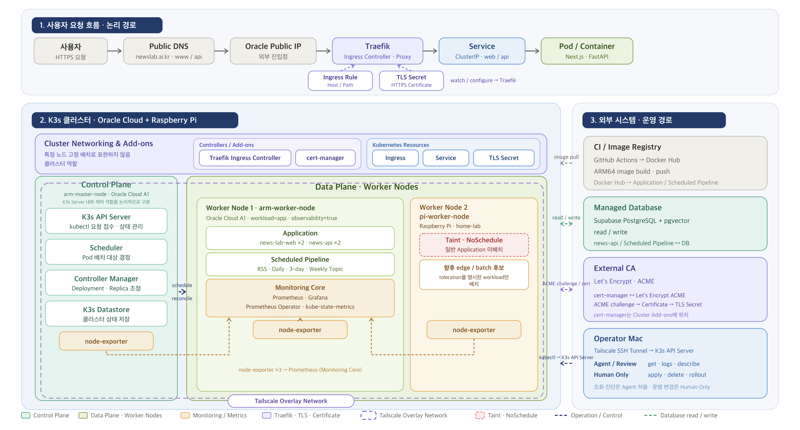

# NewsLab

NewsLab은 RSS 뉴스를 수집해 원문, embedding, Topic 요약을 PostgreSQL/Supabase에 저장하고 웹 서비스와 FastAPI read API로 제공하는 개인 운영 뉴스 플랫폼입니다.

## Live Service

- Frontend: <https://newslab.ai.kr>
- Frontend alias: <https://www.newslab.ai.kr>
- Backend API: <https://api.newslab.ai.kr>

Production reachability, DNS, TLS certificate status, rollout, and final service verification are human-controlled operations. This repository records the backend manifests and runbooks, but an agent does not claim production verification without operator-provided logs.



## 주요 기능

- RSS source 기반 기사 수집과 중복 URL 정규화
- 기사 원문 지연 추출과 수집·추출 실행 이력 저장
- 오늘의 Topic, 최근 3일 Topic, 지난주 Topic 제공
- Topic별 대표 기사, 관련 기사, Summary 근거 기사 분리
- 저장된 Topic archive, home payload, detail API 제공
- 운영 판단을 남기는 Architecture, Runbook, Verification, Devlog 문서화

## Data Pipeline

NewsLab의 backend pipeline은 RSS 수집 결과를 바로 화면에 나열하는 데서 끝나지 않고, 기사 후보를 embedding과 clustering으로 묶은 뒤 Topic 단위로 저장합니다.

```text
RSS feed
→ articles
→ article_embeddings
→ clustering / representative article selection
→ raw_articles for summary evidence
→ AI summary
→ topics / three_day_topics / weekly_topics
→ FastAPI read API
→ frontend
```

- Daily Topic: 최근 24시간 기사 후보를 대상으로 embedding을 생성하거나 재사용하고, 유사 기사 cluster에서 Topic과 Summary를 만든다.
- Three-day Topic: 최근 72시간 기사를 대상으로 기존 `article_embeddings`만 읽어 재클러스터링한다. Daily Topic 결과를 다시 집계하지 않는다.
- Weekly Topic: 직전 완료 주간의 기사를 대상으로 기존 embedding을 재사용해 주간 흐름을 만든다. Daily 또는 Three-day 결과를 집계하지 않는다.

원문 확보와 Summary provider 호출은 모든 기사에 선행 적용하지 않고, Topic 선정 후 Summary 근거 기사에 필요한 범위로 제한한다. DB write와 provider 호출이 포함된 production 실행은 사람이 영향 범위를 확인한 뒤 수행한다.

## Architecture

Backend application과 scheduled pipeline은 K3s에서 실행되고, PostgreSQL/Supabase가 기사, 원문, embedding, Topic 결과와 실행 이력을 보관합니다.

| 영역 | 역할 |
| --- | --- |
| FastAPI | 저장된 기사, Topic, 실행 상태를 read API로 제공 |
| PostgreSQL/Supabase | RSS source, articles, raw_articles, topic tables, 실행 이력 저장 |
| pgvector | 기사 제목·RSS 요약 기반 embedding 저장과 재사용 |
| K3s | API Deployment와 RSS/Topic CronJob 실행 |
| Traefik | public HTTP(S) 요청을 Service로 전달하는 Ingress Controller |
| cert-manager | Let's Encrypt ACME로 TLS Secret 발급과 갱신 관리 |
| Tailscale | public ingress가 아니라 운영자 접근과 hybrid node 간 통신 기준 |

Current backend manifest evidence in this repository:

- `news-api` Deployment: `replicas: 2`
- `news-api` Service: port `80` to container port `8000`
- `news-api` Ingress: Traefik + cert-manager, `api.newslab.ai.kr`
- Backend and CronJob image: `seocj/news-api:latest`
- CronJob node selector: `workload: app`

The architecture diagram includes the frontend runtime and `news-lab-web` placement for the whole operated service. The frontend application and its Kubernetes manifest are managed outside this backend repository, so this README does not use this repository alone as proof of the frontend replica count.

## Infrastructure / Deployment

NewsLab is operated on a hybrid 3-node K3s cluster:

- `arm-master-node`: Oracle Cloud A1 control-plane node
- `arm-worker-node`: Oracle Cloud A1 worker for application and monitoring core workloads
- `pi-worker-node`: Raspberry Pi worker connected through Tailscale, tainted to avoid accidental general application scheduling

Scheduled backend workloads are defined as Kubernetes CronJobs:

| Workload | Schedule | Entry point |
| --- | --- | --- |
| `news-rss-collector` | `03:00 Asia/Seoul` | `scripts/collect_rss.py` |
| `news-daily-topic-pipeline` | `04:00 Asia/Seoul` | `scripts/run_daily_topic_pipeline.py` |
| `news-three-day-topic-pipeline` | `05:00 Asia/Seoul` | `scripts/run_three_day_topic_pipeline.py` |
| `news-weekly-topic-pipeline` | `00:30 Asia/Seoul` every Monday | `scripts/run_weekly_topic_pipeline.py` |

GitHub Actions builds the backend Docker image for `linux/arm64` and pushes it to Docker Hub on `main` path changes or manual workflow dispatch. Kubernetes rollout is not represented as fully automated CD; production apply, rollout, and verification remain human-controlled.

## Observability

The monitoring baseline uses kube-prometheus-stack:

- Prometheus, Grafana, Prometheus Operator, and kube-state-metrics are configured for the `observability=true` node.
- node-exporter is configured with tolerations for control-plane/master nodes and the Raspberry Pi worker taint.
- Alertmanager is disabled in the current values file.
- Grafana access and production status checks are handled through runbooks and operator-controlled access paths.

## Agent Workflow

This repository uses a document-based agent-assisted workflow:

- Task files define the source of truth for each branch.
- Codex implements only the approved task unit and records actual verification commands.
- Antigravity and CodeRabbit review outputs are treated as review evidence, not direct permission to change code.
- Approved fixes must be recorded separately before implementation.
- High-risk operations such as `kubectl apply`, rollout, Supabase SQL, `git push`, and merge are human-controlled.

The workflow is deliberately conservative: automation helps implementation, review, and evidence collection, while production-impacting decisions stay with the operator.

## 주요 설계 결정

- Daily, Three-day, and Weekly Topic pipelines are separate result models rather than rollups over each other, so each window can use its own candidate limit, clustering threshold, and persistence contract.
- Three-day and Weekly pipelines reuse existing `article_embeddings` instead of generating new embeddings during those jobs, reducing provider coupling and making missing embeddings explicit.
- Raw article extraction is deferred until selected Summary evidence requires it, avoiding broad article-body fetching before Topic selection.
- The Raspberry Pi worker is part of the cluster network and monitoring target, but general application scheduling is constrained with taints and node selectors.
- GitHub Actions publishes images, but Kubernetes rollout is intentionally separated from image publishing.

## Documentation

- [Architecture index](docs/ARCHITECTURE.md)
- [Runbook index](docs/RUNBOOK.md)
- [Pipeline architecture](docs/architecture/pipeline.md)
- [K3s runtime](docs/architecture/k3s-runtime.md)
- [Domain and TLS](docs/architecture/domains.md)
- [3-day Topic design](docs/design/three-day-topic-pipeline.md)
- [Weekly Topic design](docs/design/weekly-topic-pipeline.md)
- [Agent workflow](docs/agent/backend-workflow.md)
- [Current task](docs/tasks/docs-readme-portfolio-refresh.md)
- [Current verification](docs/verification/docs-readme-portfolio-refresh.md)
- [Raspberry Pi worker join verification](docs/verification/infra-pi-worker-join.md)
- [Monitoring baseline verification](docs/verification/infra-monitoring-baseline.md)

Task, Verification, Review, Fix, PR, and Devlog records under `docs/` preserve how changes were investigated, implemented, reviewed, and verified over time.

## Local Development

```bash
python3 -m venv .venv
source .venv/bin/activate
pip install -r requirements.txt
uvicorn app.main:app --reload
```

Pipeline scripts default to local or dry-run oriented usage unless explicit execution flags are provided. Options that perform DB writes, raw extraction, provider calls, or production CronJob execution should be treated as operator-controlled actions.

Examples:

```bash
python scripts/run_three_day_topic_pipeline.py --window-end \
  2026-06-23T05:00:00+09:00
```

```bash
python scripts/run_weekly_topic_pipeline.py --week-start 2026-06-15
```
