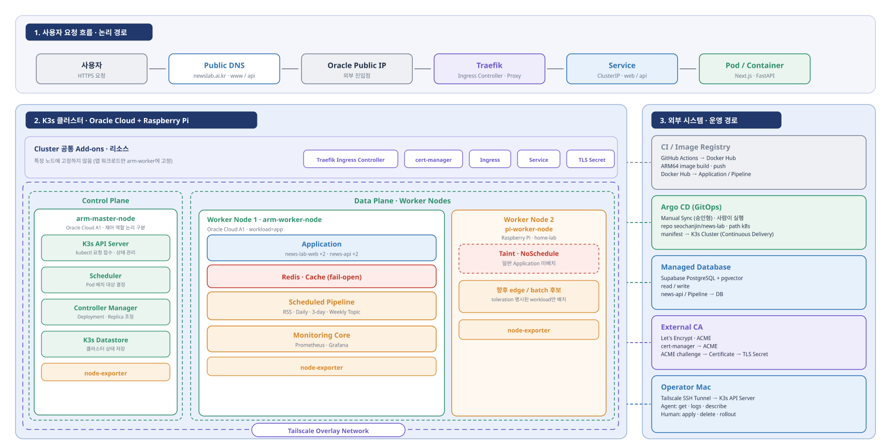

# NewsLab Backend Architecture

이 문서는 backend architecture의 진입점이다. 세부 내용을 한 파일에 반복하지
않고 작업 범위에 맞는 문서만 선택해 읽는다.

## 전체 구조

NewsLab은 RSS 수집, 기사 원문 추출, 주제 생성 결과를 PostgreSQL/Supabase에
저장하고 FastAPI read API로 제공한다. application과 scheduled pipeline은
Oracle Cloud A1 node의 K3s cluster에서 실행된다.



다이어그램은 사용자 요청, hybrid K3s topology, 외부 시스템과
운영자 접근 경로를 함께 보여 준다. Frontend resource는 별도
`news-lab-web` 저장소가 관리하므로, 이 저장소에서 직접 증명하는
범위는 Backend manifest와 기존에 기록된 운영 검증이다.

```text
RSS source
→ collector / extractor / topic pipeline
→ PostgreSQL/Supabase
→ FastAPI
→ backend API domain
```

## 사용자 요청 경로

```text
User
→ Public DNS
→ Oracle Public IP
→ Traefik Ingress
→ Kubernetes Service
→ Application Pod
```

Frontend와 Backend는 위 논리 단계를 각각 따른다. Frontend Service는
Next.js Pod를, Backend `news-api` Service는 `app: news-api` selector로 FastAPI
Pod만 선택한다. 이 저장소의 manifest는 Backend의 `news-api-ingress
→ news-api Service → FastAPI Pod` 구간을 직접 정의한다. Public DNS와
Oracle Public IP 연결은 외부 인프라이므로 manifest의 host만으로 실시간
정상 상태를 판정하지 않는다.

## K3s topology

- `arm-master-node`: Oracle Cloud A1 control plane. 일반 application을
  배치하지 않으며 node-exporter는 taint toleration으로 실행할 수 있다.
- `arm-worker-node`: Oracle Cloud A1 application worker. Frontend·Backend,
  Redis, scheduled pipeline과 monitoring core를 실행한다.
- `pi-worker-node`: Tailscale로 cluster에 연결된 Raspberry Pi worker.
  `node-role=news-edge-worker:NoSchedule` taint로 일반 application을 막고
  node-exporter를 실행하며, explicit toleration을 갖춘 향후 edge/batch
  workload 후보다.

이 placement는 manifest의 `workload: app`, `observability: "true"` selector와
node-exporter toleration, 그리고 기존의 사람 제공 Production Verification에
근거한다. 현재 live node 상태는 새 운영 log 없이 재검증된 것으로
표현하지 않는다.
또한 Traefik, cert-manager, Ingress, Service와 TLS Secret은 cluster 공통
리소스이며 특정 노드의 전용 application placement로 표현하지 않는다.

## 외부 시스템과 운영 경로

- GitHub Actions는 ARM64 image를 Docker Hub에 발행하고 Backend manifest 변경
  PR을 만든다. Argo CD는 Git desired state를 추적하고 사람이 diff를
  검토한 뒤 Manual Sync를 실행한다.
- FastAPI와 scheduled pipeline이 PostgreSQL/Supabase에 접근한다.
  Database가 K3s의 Redis나 application에 먼저 요청하는 구조가 아니다.
- cert-manager가 Let's Encrypt ACME를 통해 TLS Secret을 관리한다.
- Operator는 Tailscale SSH tunnel로 control plane의 K3s API에 접근한다.
  Tailscale overlay는 hybrid node와 operator를 위한 경로이며 public ingress가
  아니다.

## Home Cache 경계

PostgreSQL/Supabase는 Daily·3-day·Weekly Topic 결과의 Source of Truth이고,
Redis는 persistence 없이 다시 채울 수 있는 cache 계층이다. FastAPI Home API는
Redis를 먼저 읽고 miss이면 PostgreSQL에서 payload를 만든 뒤 cache 저장을
시도한다. Redis 미설정, 연결 실패, timeout, payload 손상과 읽기·쓰기 오류는
PostgreSQL fallback 또는 Pipeline 계속 실행으로 격리하는 fail-open 정책을
사용한다.

각 Pipeline은 PostgreSQL 저장 성공 이후 Home API와 동일한 payload builder로
대응 key를 overwrite한다. PostgreSQL과 Redis 사이에 직접 통신 경로는 없으며,
FastAPI와 각 Pipeline이 두 저장 계층에 각각 접근한다.

| Pipeline | Post-save prewarm key | TTL |
| --- | --- | --- |
| Daily | `topics:home:v1` | `108000`초 |
| 3-day | `three-day-topics:home:v1` | `108000`초 |
| Weekly | `weekly-topics:home:v1` | `691200`초 |

TTL은 오래된 cache의 장기 잔류를 제한하는 안전장치이며 최신성은 post-save
prewarm으로 관리한다. 기존의 사람이 수행한
[Pipeline prewarm 운영 검증](verification/chore-verify-home-cache-prewarm.md)은
세 Pipeline이 Home API 최초 요청 전에 각 key를 생성했고, 요청 뒤 TTL이
재설정되지 않고 감소한 시점 증거를 기록한다. 이 기록은 현재 live cache 상태를
새로 검증했다는 의미가 아니다. 상세 cache-aside 동작과 로그 event는
[FastAPI와 API 영역](architecture/backend-api.md), 저장 경계는
[Pipeline](architecture/pipeline.md)을 참고한다.

## 현재 운영 구성

- API application: `news-api`
- Database: PostgreSQL/Supabase
- Cache: Redis fail-open Home Cache
- Scheduled workload:
  - `news-rss-collector`
  - `news-daily-topic-pipeline`
  - `news-three-day-topic-pipeline`
  - `news-weekly-topic-pipeline`
- Runtime: Oracle Cloud A1 기반 K3s
- Ingress: Traefik
- TLS: cert-manager와 `letsencrypt-prod`
- Remote operation: Tailscale SSH tunnel

운영 변경과 production verification은 사람이 수행한다.

## Backend 배포 기준

Backend `news-api` 운영 workload는 full Git SHA image tag를 사용한다. GitHub
Actions는 image build 성공 후 Kubernetes manifest image tag 갱신 branch와 PR을
생성하고, 사람이 manifest PR을 검토해 merge한다. Argo CD `news-api`
Application은 automated sync 없이 Git과 live state의 차이를 보여주며, 사람이
diff를 확인한 뒤 Manual Sync를 승인한다.

Rollback도 `latest`나 rollout restart가 아니라 이전 정상 full SHA를 manifest에
반영하는 PR, merge, Argo CD Manual Sync로 수행한다. Auto sync, automatic prune,
automatic self-heal은 적용하지 않는다.

## 세부 문서

- [전체 구성과 책임](architecture/overview.md)
- [FastAPI와 API 영역](architecture/backend-api.md)
- [Database 구조](architecture/database.md)
- [수집·추출·주제 pipeline](architecture/pipeline.md)
- [K3s runtime](architecture/k3s-runtime.md)
- [Domain과 TLS](architecture/domains.md)
- [Argo CD Manual Sync 설계](architecture/argocd-manual-sync-design.md)
- [Home API Redis Cache 설계](design/home-api-redis-cache.md)
- [3일 Topic 저장·실행 설계](design/three-day-topic-pipeline.md)
- [7일 Topic 저장·실행 설계](design/weekly-topic-pipeline.md)

운영 command는 [Runbook index](RUNBOOK.md), agent 작업 절차는
[Backend agent workflow](agent/backend-workflow.md)를 참고한다.
